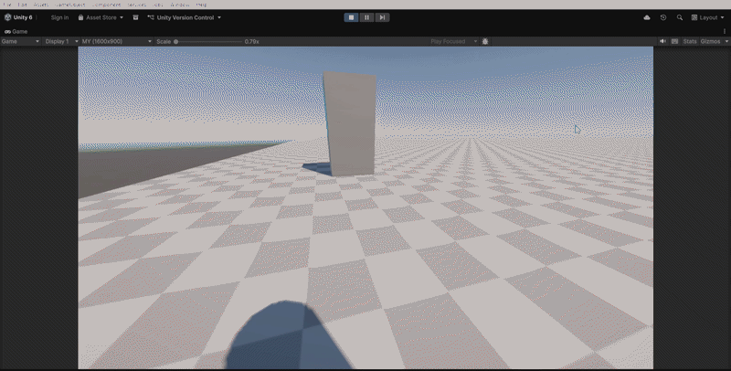

# Source Engine Movement

A Unity-based movement controller inspired by the movement mechanics of the Source Engine, written in C#.

This project focuses on recreating responsive first-person movement, including acceleration, friction, air movement, and bunny hopping.

## Features

* [x] Ground Movement
* [x] Air Movement
* [x] Acceleration and Deceleration
* [x] Friction
* [x] Bunny Hopping
* [x] Air Strafing
* [x] Speed Control
* [x] First-Person Camera

## Technical Overview

The movement controller is designed to provide responsive player movement inspired by classic Source Engine games.

Key concepts explored in this project include:

* Ground and air movement
* Acceleration and friction
* Velocity management
* Player input handling
* Movement physics
* Maintaining and controlling player speed

## Technologies

* **Engine:** Unity 6000.2.10f1
* **Language:** C#

## Getting Started

### Requirements

* Unity Hub
* The Unity version used to develop this project

### Installation

1. **Download** Project **and** **Just** put the **Player** **script** in your **gameObject**.

## Controls

| Action      | Key   |
| ----------- | ----- |
| Move        | WASD  |
| Jump        | Space |
| Look Around | Mouse |

## Development Goals

The main goal of this project is to study and implement responsive movement mechanics while improving my understanding of:

* C# gameplay programming
* Unity physics and movement systems
* Player controllers
* Game feel and responsive controls
* Clean and maintainable code

## Demo

